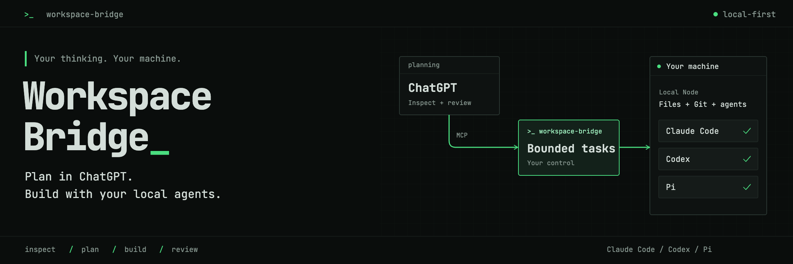
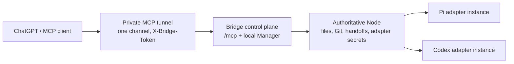

# Workspace Bridge



**Connect ChatGPT Web to your local workspace and agent runtime.**

Workspace Bridge is a local MCP control plane that lets ChatGPT Web work with
the real files, Git state, handoffs, and coding agents on your machine. It
turns a conversation into a practical loop: ChatGPT inspects the workspace,
develops and explains a plan, breaks the work into bounded implementation
tasks, sends those tasks to a configured local runtime such as Pi or Codex,
then reads the result back to audit and iterate.

```text
ChatGPT Web — plan, decompose, audit
       │
       │ private MCP tunnel
       ▼
Workspace Bridge + local Manager
       │
       │ authoritative Node
       ▼
Local workspace, Git, handoffs, and agent adapters
       ├── Pi
       ├── Codex
       └── future runtimes
```

## Why this project exists

The goal is to use ChatGPT Web's large reasoning capacity where it has the
most leverage: elaborating the approach, breaking complex work into precise
tasks that a lower-cost implementer can follow, and auditing the result for
another iteration when needed. This keeps planning and review in the strongest
conversation while execution happens against the current local checkout.

The project itself follows that same split development loop: ChatGPT 5.6 at
extra-high reasoning acts as the planner and auditor, while Muse Spark 1.3
running through Pi acts as the local implementer. Workspace Bridge supplies
the file, Git, handoff, and runtime connection between those roles.

Operationally, Workspace Bridge exposes bounded project and agent APIs — not
an arbitrary remote shell. Source is read-only by default. A local
administrator can explicitly enable text writes per workspace and, separately,
opt in to bounded agent runs on explicitly configured adapter instances.

- One private MCP endpoint (`/mcp`) behind one outbound tunnel and one shared
  gateway credential, serving every explicitly enabled workspace.
- Every project call carries an explicit `workspace_id`. There is no ambient
  working directory and no per-chat authorization.
- Manual handoff flow always works: ChatGPT publishes a small plan, you paste
  it into your local agent, then paste the reply back for audit.
- Optional agent runs (Pi or Codex) through Runtime Protocol v1, only on an
  explicitly enabled workspace route, using exactly one of a prepared handoff
  or a bounded direct instruction (the Bridge publishes the latter as a
  minimal auditable handoff).
- Local Manager on loopback for mappings, tokens, routes, models, profiles,
  runs, and diagnostics. It is never tunnelled.

> Security in one minute: one shared gateway credential authorizes all
> enabled mappings, so disable anything ChatGPT should not see. Source read
> through the tunnel leaves your machine. There is no remote shell, no
> per-chat ACL, and no complete secret detection. Keep the Manager local,
> keep tokens out of chat and repos, and review each runtime profile before
> enabling writes or runs. See [Security](docs/SECURITY.md).

## Supported clients, runtimes, platforms

- **Clients:** ChatGPT (prominent, via the official secure tunnel client) and
  any compatible MCP client that supports Streamable HTTP and the tool
  shapes in [MCP tools](docs/MCP_TOOLS.md).
- **Runtimes:** Pi (`workspace-bridge-pi-host-adapter` on npm) and Codex
  (packaged `workspace-bridge-codex-adapter` executable). Both speak Runtime
  Protocol v1 through a Node-owned adapter instance. See
  [Runtimes](docs/RUNTIMES.md).
- **Platforms:** macOS and Linux, plus WSL2. Native Windows is not supported.
  macOS services use launchd; Linux services use systemd. Docker is a
  Bridge-control-plane option, with a versioned multiarch image on GHCR;
  Nodes and adapters stay native on their hosts. See [Docker](docs/DOCKER.md).

## How it works



ChatGPT calls typed tools (`list_workspaces`, `read_file`, `prepare_handoff`,
`start_agent_run`, and others; see the tool reference for the exact list). The Bridge resolves the workspace to its
authoritative Node; the Node enforces its host `allowed_roots` ceiling and
serves files, Git evidence, handoffs, and runtime proxying. Adapter daemons own
their native sessions and security enforcement. See
[Architecture](docs/ARCHITECTURE.md) and [Runtime Protocol](docs/RUNTIME_PROTOCOL.md).

## Quick start (about 5–10 minutes)

This is the supported happy path: persistent installs, a local Bridge, one
host-only Node, and the local Manager. Details, Docker, and alternatives live
in [Setup](docs/SETUP.md).

```sh
uv tool install workspace-bridge
workspace-bridge --version

workspace-bridge init
workspace-bridge node --state "$HOME/.local/state/workspace-bridge-node" init \
  --allow-root "$HOME/Projects"
workspace-bridge node --state "$HOME/.local/state/workspace-bridge-node" service install
workspace-bridge serve
```

Then in another terminal, display the tokens you will register (output stays
in this terminal; never paste it into chat):

```sh
workspace-bridge show-admin-token
workspace-bridge node --state "$HOME/.local/state/workspace-bridge-node" show-token
```

Open `http://127.0.0.1:8766/`, enter the admin token, add and register the
Node with its URL plus Node token FIRST, then add one workspace mapping,
create the shared gateway credential, and enable the project. Adapter setup
is optional for browsing and manual handoffs and is required only for
automated Pi/Codex runs; see [Setup](docs/SETUP.md) and
[Runtimes](docs/RUNTIMES.md). Generate the tunnel profile and connect your
MCP client to `/mcp` only.
Verify with:

```sh
workspace-bridge doctor
```

`doctor` reports configuration, workspace prerequisites, adapter health, and
runnable workspace/adapter routes. The Manager enables a prepared-handoff
start only when the exact `(workspace_id, adapter_id)` route is ready.

## Features

- Bounded browsing: trees, globs, regex search, paginated reads with hashes,
  and read-only Git status/diffs as live review evidence.
- Planning handoffs: `prepare_handoff` publishes `TASK.md`, `CONTEXT.md`,
  `ACCEPTANCE.md` under `.workspace-handoff/jobs/job_<id>/`.
- Policy-controlled writing: per-workspace `none`, `handoff` (default), or
  `workspace` scope. Local-admin only; no MCP override.
- Image reads through the same reader: supported rasters return native MCP
  image previews with explicit limits. Visible pixel secrets are not redacted.
- Runtime Protocol v1 runs with resumable interactions, bounded activity and
  execution evidence, and durable per-channel notifications (Discord).
- Diagnostics (`doctor`), sanitized support bundles, native logging bounds,
  release identity, and manual updates. No automatic updater and no automatic
  support upload.

Tool names and schemas are authoritative from tool discovery; see the
[tool reference](docs/MCP_TOOLS.md) for the exact list.

## Project status and limitations

- Current version: `0.1.1`. Manual package updates only
  (`uv tool upgrade workspace-bridge`, then restart affected services).
- Native Windows is unsupported; use WSL2.
- Image previews are first-frame, size-bounded, and not color-managed. A local
  tool success does not prove your tunnel client passes pixels to the model;
  verify with a fresh visual marker. See [Image support](docs/IMAGE_SUPPORT.md).
- No automatic package updater and no automatic support upload. Support
  bundles are created locally and must be reviewed before sharing.
- Live deployment combinations may not all be validated in every checkout.
  Combinations that have not run as a live Bridge plus Node plus tunnel smoke
  are listed under [Known limitations / validation status](docs/OPERATIONS.md#known-limitations--validation-status).
- Root service mode is advanced only. A root-owned Node state managed as root
  runs the Node as root with full Node filesystem authority; a root-owned
  adapter state managed as root runs that adapter and its native agent as
  root. Running the Node as root does not by itself make separately non-root
  adapter services root. Prefer dedicated non-root service identities.

## Documentation

- [Documentation index](docs/README.md) — map by audience.
- [Setup](docs/SETUP.md) — canonical human installation and configuration.
- [Agent setup](docs/AGENT_SETUP.md) — deterministic runbook for an AI agent
  preparing Workspace Bridge for a user.
- [Architecture](docs/ARCHITECTURE.md) — components, authority, trust
  boundaries, and deployment.
- [Runtimes](docs/RUNTIMES.md) — Pi and Codex notes in one place.
- [Operations](docs/OPERATIONS.md) — state, services, upgrades, bundles,
  recovery, limitations.
- [Security](docs/SECURITY.md), [MCP tools](docs/MCP_TOOLS.md),
  [Runtime Protocol](docs/RUNTIME_PROTOCOL.md),
  [File access](docs/FILE_ACCESS.md), [Images](docs/IMAGE_SUPPORT.md),
  [Handoff protocol](docs/HANDOFF_PROTOCOL.md), [Docker](docs/DOCKER.md),
  [References](docs/REFERENCES.md).
- [Contributing](CONTRIBUTING.md) — contributor setup, tests, and docs rules.

## License

MIT. See [LICENSE](LICENSE).
