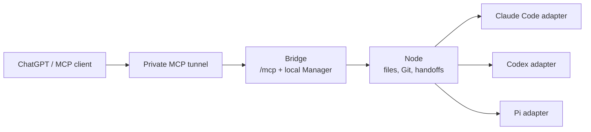

# Workspace Bridge


**Plan in ChatGPT. Build with your local agents.**

Workspace Bridge lets ChatGPT read the real code on your machine, plan the
work, hand bounded tasks to Claude Code, Codex, or Pi running locally, and
then review what they changed. You keep the strongest model for thinking and
reviewing, a cheaper local agent does the typing, and nothing runs that you
have not enabled.

```text
ChatGPT ── plans, splits the work, reviews the result
   │
   │  one private MCP tunnel
   ▼
Workspace Bridge ── your local admin console decides what is visible and allowed
   │
   ▼
Your machine ── real files, Git, and local agents (Claude Code, Codex, Pi)
```

## Why

Big reasoning models are best at understanding a codebase, designing an
approach, and checking work. They are expensive to use for every keystroke.
Local coding agents are good at carrying out a precise task against the
current checkout. Workspace Bridge connects the two in one loop:

1. **Inspect.** ChatGPT browses your project, searches it, and reads live Git
   status and diffs.
2. **Plan.** It writes a short, reviewable handoff: task, context, and
   acceptance criteria.
3. **Build.** You paste the handoff into your agent, or, if you have enabled
   it, ChatGPT starts a bounded run on Claude Code, Codex, or Pi directly.
4. **Review.** ChatGPT reads the result and the new diff, then approves the
   work or plans the next iteration.

Workspace Bridge is built this way: a frontier model plans and audits, and a
local agent implements through the Bridge.

Why plan in ChatGPT:

- **It already knows you.** ChatGPT's built-in memory carries your preferences
  and past decisions into every planning session, with nothing to set up.
- **Take your time.** Planning is a conversation, not a metered job. With
  ChatGPT's generous usage limits you can explore, push back, and refine a
  plan without worrying about running up a bill.
- **Truly remote work.** The ChatGPT mobile app can drive the whole loop, so
  you can plan, start runs on your Claude Code, Codex, or Pi agents, and review
  the results from anywhere while your machine does the building.


## Safe by default

- **Read-only until you say otherwise.** New projects start disabled. Once
  enabled, ChatGPT can write only planning notes; source edits are a separate,
  per-project switch.
- **No remote shell.** ChatGPT gets typed tools for browsing, Git evidence,
  handoffs, and runs. It cannot run arbitrary commands.
- **Agent runs are opt-in per project and per agent.** Each run uses a
  security profile you choose; anything the profile marks "ask" pauses the
  run until it gets an explicit answer.
- **Your admin console never leaves your machine.** The Manager listens on
  loopback only and is never tunnelled.
- **Secrets stay out.** Common credential files are blocked, tokens are kept
  out of APIs, logs, and chat, and support bundles are created locally and
  never uploaded automatically.

Know the limits too: one shared connection credential covers every enabled
project, and source that ChatGPT reads leaves your machine. Read
[Security](docs/SECURITY.md) before enabling writes or agent runs.

## What you get

- **Project browsing:** directory trees, globs, regex search, paginated reads
  with hashes, and read-only Git status and diffs.
- **Planning handoffs:** `TASK.md`, `CONTEXT.md`, and `ACCEPTANCE.md`
  published under `.workspace-handoff/`, ready to paste into any agent.
- **Local agent runs:** Claude Code, Codex, and Pi through one runtime
  protocol, with per-agent model policy, security profiles, resumable
  approvals, and run-scoped usage.
- **Images:** screenshots and other rasters return as native previews.
- **Local Manager:** a terminal-style admin console for projects, agents,
  routes, models, runs, and diagnostics.
- **Operations:** `doctor` diagnostics, sanitized support bundles, native
  services on macOS and Linux, Discord run notifications, and a Docker image.

Works with ChatGPT through OpenAI's secure MCP tunnel, and with any MCP
client that supports Streamable HTTP. Runs on macOS, Linux, and WSL2.

## Quick start (about 10 minutes)

Install the package, then initialize the Bridge and one Node (the local
service that owns your files):

```sh
uv tool install workspace-bridge
workspace-bridge init
workspace-bridge node --state "$HOME/.local/state/workspace-bridge-node" init \
  --allow-root "$HOME/Projects"
workspace-bridge node --state "$HOME/.local/state/workspace-bridge-node" service install
workspace-bridge serve
```

In another terminal, show the Node token. It stays in your terminal; never
paste it into chat:

```sh
workspace-bridge node --state "$HOME/.local/state/workspace-bridge-node" show-token
```

Then open the Manager at `http://127.0.0.1:8766/`:

1. Sign in with the temporary bootstrap account (see
   [Setup](docs/SETUP.md#3-credentials-you-will-handle)) and choose your own
   password.
2. Register the Node with its URL and the token from above.
3. Add a workspace mapping for one project and enable it.
4. Create the shared gateway credential and generate the tunnel profile.
5. Connect ChatGPT (or another MCP client) to `/mcp`.

Check everything with:

```sh
workspace-bridge doctor
```

Browsing and manual handoffs work at this point. To let ChatGPT start agent
runs, add a Claude Code, Codex, or Pi adapter; see [Runtimes](docs/RUNTIMES.md).
Full instructions, including Docker, are in [Setup](docs/SETUP.md). If you
would rather have a coding agent do the install, point it at
[Agent setup](docs/AGENT_SETUP.md).

## How it works



The **Bridge** serves the MCP endpoint and the local Manager. Each **Node**
owns the files, Git, and handoffs on its host and never lets the Bridge reach
outside its allowed roots. **Adapters** wrap each local agent and enforce its
security profile. A run reaches an agent only through an exact
workspace-to-adapter route you enabled. See
[Architecture](docs/ARCHITECTURE.md).

## Status

Version `0.2.0`, an early release under active development. Updates are
manual (`uv tool upgrade workspace-bridge`, then restart services); there is
no auto-updater. Native Windows is not supported; use WSL2. Known gaps and
validation status are listed in
[Operations](docs/OPERATIONS.md#known-limitations--validation-status).

## Documentation

- [Setup](docs/SETUP.md): install and configure.
- [Agent setup](docs/AGENT_SETUP.md): runbook for a coding agent installing
  Workspace Bridge for you.
- [Runtimes](docs/RUNTIMES.md): Claude Code, Codex, and Pi.
- [Security](docs/SECURITY.md): threat model and controls.
- [Architecture](docs/ARCHITECTURE.md) and [Operations](docs/OPERATIONS.md).
- [MCP tools](docs/MCP_TOOLS.md), [Runtime Protocol](docs/RUNTIME_PROTOCOL.md),
  [File access](docs/FILE_ACCESS.md), [Images](docs/IMAGE_SUPPORT.md),
  [Handoff protocol](docs/HANDOFF_PROTOCOL.md), [Docker](docs/DOCKER.md),
  [References](docs/REFERENCES.md).
- [Full documentation index](docs/README.md).
- [Plugin skill packaging](docs/PLUGIN_SKILL_PACKAGING.md): embed the canonical
  skill with an existing private/workspace MCP app.

## Contributing and security

Contributions are welcome; start with [CONTRIBUTING.md](CONTRIBUTING.md).
Report vulnerabilities privately as described in the
[security policy](.github/SECURITY.md), not in public issues.

## License

MIT. See [LICENSE](LICENSE).
