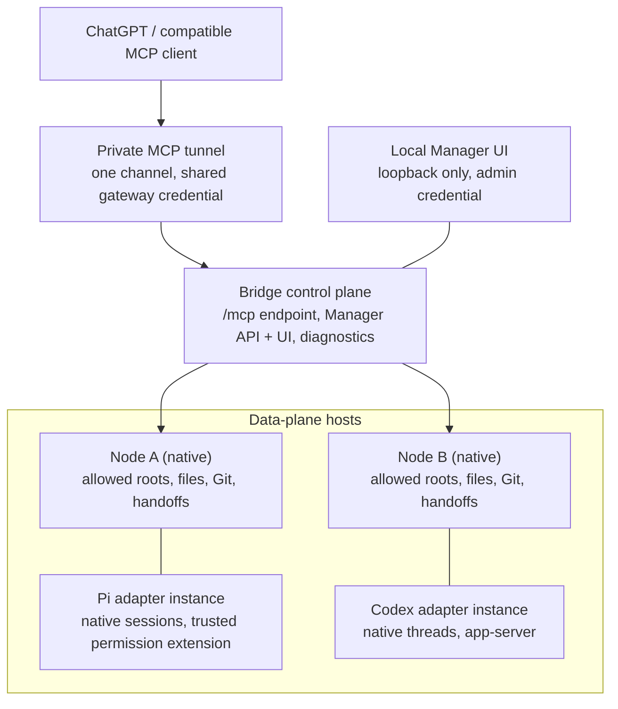
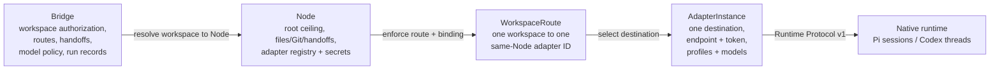
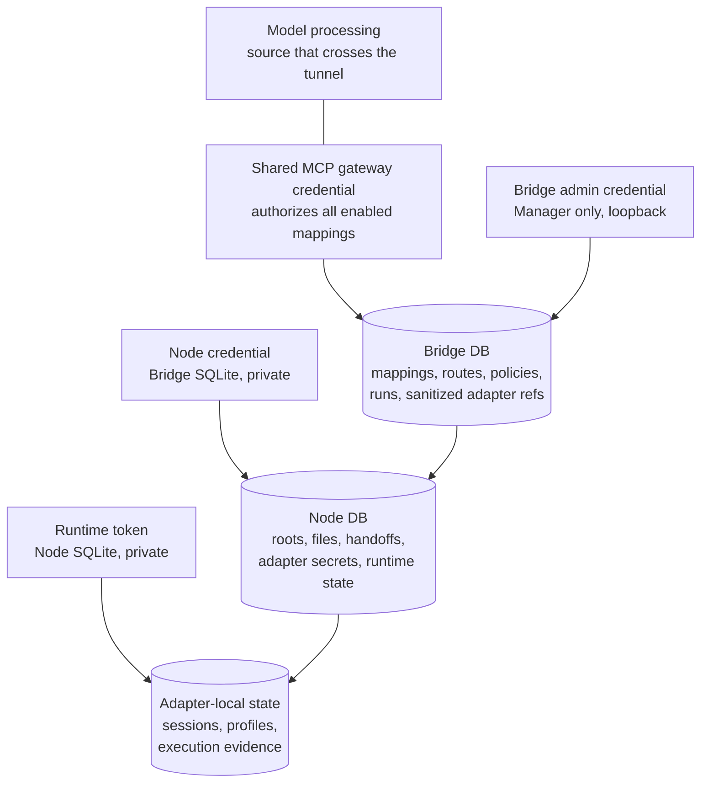
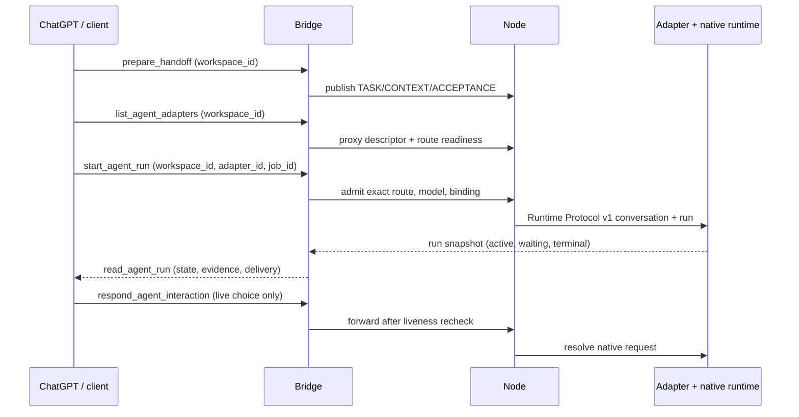
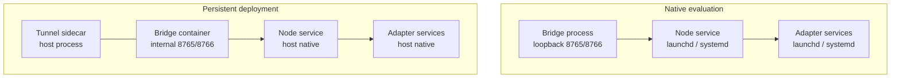

# Architecture

Source-accurate reference for Workspace Bridge `0.1.1`: Bridge control plane
plus local Manager, authoritative Nodes, Node-owned adapter instances
(Pi/Codex), exact workspace routes, Runtime Protocol v1, optional secure MCP
tunnel, native services on macOS and Linux, manual package updates, and
bounded logs with support bundles.

## Component and deployment topology

Component responsibilities:

- `api.py`: strict typed tool schemas, tools-only MCP adapter, loopback
  Manager API.
- `service.py`: auth, mappings, Node-routed operations, handoff publication,
  write policy, adapter references, workspace routes.
- `node_service.py` / `node_api.py`: Node data plane (allowed roots, files,
  images, Git, handoffs, adapter secrets).
- `node_registry.py` / `node_client.py`: Bridge-side Node inventory and
  bounded Node protocol proxy.
- `adapter_registry.py`: sanitized Bridge cache of Node-owned instances with
  on-demand Node runtime proxying.
- `diagnostics.py`: sole server-side evaluator for the canonical diagnostic
  report and runnable-route model, shared by Doctor and the admin API.
- `git_evidence.py`: bounded read-only Git status and diff collection.
- `run_coordinator.py`: adapter-ID-keyed conversations, runs, interactions,
  and activity persistence plus reconciliation for Runtime Protocol v1.
- `wbrp.py`: validated bounded private HTTP client for adapters.
- `codex_host_adapter.py` / `codex_rpc.py`: Codex app-server host adapter
  with native thread ownership.
- `runtime/pi-host-adapter/`: Pi adapter around natively hosted Pi sessions,
  including its trusted permission extension.
- `notifications.py`: Bridge-owned semantic events, durable per-channel
  outbox, named channel adapters (Discord configured from local environment).
- `security.py`: shared validation primitives (traversal, exclusions,
  bounded reads, publication, hash-checked writes).
- `media.py` / `image_worker.py`: typed image results and a fixed, timed
  decoder for authorized bytes.
- `browse.py`: live trees, globs, bounded search with signed cursors and
  hashes.
- `embedded_skill.py` plus `skills/project-lead/SKILL.md`: packaged
  project-lead guidance retrieved on demand.
- `web/` plus `static/dist/`: Manager source and compiled assets served by
  Starlette on the same loopback listener.

## Authority and data path

A `RuntimeType` (`pi` or `codex`) names the protocol family; it is not a
destination. An `AdapterInstance` is one Node-owned destination with its own
name, endpoint, token, enabled state, and connection revision. A
`WorkspaceRoute` binds one workspace to one exact same-Node adapter ID with
enabled/default state and a security binding. Model policy and profile
discovery are scoped to the adapter instance. There is no implicit cross-Node
or runtime-type fallback. The MCP discovery tool returns sanitized adapter
IDs and exact route availability.

Reads flow: shared credential, explicit enabled workspace, authoritative
Node, host ceiling check, bounded untrusted source with pagination. The
Bridge never opens a workspace root itself and never falls back to a local
checkout. Writes flow through the same route plus the mapping's current
write scope (`none`, `handoff`, `workspace`), loaded per call. Git evidence
is fixed-function status and diff output; it creates no snapshots and proves
no authorship.

## Credentials and trust boundaries

Boundaries:

- Bridge credential versus admin credential versus Node credential versus
  runtime token are four distinct secrets with distinct storage and entry
  points (see [Setup](SETUP.md)). One-time output stays local.
- Bridge DB versus Node DB versus adapter-local state: the Bridge holds
  sanitized adapter references; the Node holds adapter secrets and
  data-plane state; each adapter holds native sessions and profiles. All
  state files are private (`0700` directories, `0600` files).
- Write scope governs new handoff publication and source mutation; exact
  route enablement governs run admission. One does not imply the other.
- Runtime profiles are pre-tool policy claims, not necessarily OS sandboxes.
  Pi runs with the host user's authority through its trusted permission
  extension; Codex enforces its native permission and approval policy. Review
  each profile before enabling writes or runs.
- Source returned through the tunnel reaches model processing. The tunnel
  removes a public inbound endpoint; it does not keep code local. Exclusions
  and redaction are conservative and heuristic, not complete protection.

## Run and interaction sequence

Admission requires the workspace enabled, the exact same-Node route and
adapter enabled, the handoff prepared in that workspace (or a bounded direct
instruction published as a minimal auditable handoff), an allowed model, a
reachable Node, and a matching conversation binding. Each accepted run stores
an immutable Node/adapter revision plus an effective-security snapshot.
Interactions resolve only against live native requests; persisted copies are
insufficient. Continuation reuses a terminal conversation only after live
ownership proof (exists, same workspace, idle on the current same-Node
adapter). Bridge never replays a prompt or approval on recovery; unconfirmed
operations become interrupted or orphaned with stale interactions.

## Native versus container control plane

Native evaluation runs Bridge, Node, and adapters as host processes on
loopback. Persistent deployment runs only the Bridge control plane (plus the
tunnel sidecar) in Compose; Node and adapters stay native with identical
absolute workspace paths. A loopback-only Node is not reachable from the
container; Docker Desktop uses an explicit non-loopback Node host with a
firewall review and the `host.docker.internal` Bridge-side URL. The Manager
is loopback-only in both modes and is never tunnelled.

## State ownership and failure domains

- Bridge process failure: in-flight MCP calls fail; durable mappings,
  routes, policies, handoffs records, runs, and notification outbox rows
  persist in Bridge SQLite. Restart reconciles without replaying prompts.
- Node service failure: workspaces on that Node become unavailable and its
  routes stop being ready. Bridge mappings remain but fail closed; no local
  checkout fallback exists. Other Nodes are unaffected.
- Adapter plus native runtime failure: runs on that instance stop making
  progress. The Codex adapter and its owned app-server form one supervised
  unit: unexpected native loss terminates the adapter so the supervisor
  restarts the whole unit instead of leaving a permanently degraded HTTP
  surface. Active runs are marked interrupted, never replayed; idle persisted
  conversations remain resumable.
- Notification channel failure never changes run state. Delivery is
  at-least-once across the crash window between remote acceptance and
  persisted confirmation, so one duplicate is possible after restart.

## Service lifecycle

- macOS: per-user LaunchAgents under `~/Library/LaunchAgents/`, starting
  after user login and restarting on unexpected exit.
- Linux: system units under `/etc/systemd/system/`, starting at boot and
  surviving logout, with `User=`/`Group=` keeping the process non-root as
  the installing user. Install commands run without leading `sudo`; the
  backend uses only fixed narrow `sudo` operations. Journal inspection is
  manual for normal troubleshooting; routine service status does not read
  journal text. Only the sanitized support bundle collector reads journals
  programmatically, via a fixed bounded `journalctl` invocation with strict
  sanitization.
- Service artifacts contain only the stable launcher
  (`workspace-bridge node --state <state> serve` or
  `workspace-bridge adapter --state <state> serve`), never tokens or project
  roots. `service status` is read-only and combines OS state with a bounded
  authenticated health check. `service uninstall` removes only the managed
  unit; state, tokens, bindings, and logs remain.
- Root mode is intentional only and per component: a root-owned Node state
  managed as root runs the Node as root, while a root-owned adapter state
  managed as root runs that adapter and its native agent as root. Running
  the Node as root does not by itself make separately non-root adapter
  services root. Mixed-ownership invocations are rejected, never converted.

## Release identity and skew

Every deployed component exposes a bounded content-addressed identity with
product `workspace-bridge`, product version `0.1.1`, component name and
version, and a deterministic build ID over production inputs only. The
product version is the release; the component version is that component's
own version; adapter and native semantic versions stay separate fields.
Targets are read-only: the Manager System / Versions view shows skew with
manual-update guidance and performs no installs. Bridge-first upgrades are
supported; compatible Nodes and adapters may lag until the operator chooses
a maintenance window. Protocol and feature compatibility stay strict, while
malformed optional release metadata is observed as degraded update metadata
without making an otherwise valid descriptor unavailable.

## Logging, support bundles, extension points

- Docker Bridge and tunnel logs use `json-file` rotation (`10m x3`).
- macOS managed services bound each output stream to a 10 MiB active file
  plus two 10 MiB archives under private state via a package-owned guard for
  managed units only. Linux units log to the host journal; retention is the
  host journald policy. Logs carry bounded IDs, states, counts, and codes
  only — never prompts, results, paths, scopes, credentials, or raw bodies.
- `workspace-bridge support bundle` builds a private `0600` ZIP (at most 5
  MiB) with projected diagnostics, safe service status, and bounded log
  excerpts. No upload occurs; review before sharing.
- Runtime extension points: new notification channels implement the channel
  interface without changing run orchestration; new runtimes must pass the
  Runtime Protocol conformance gate (idle-only admission, exact interaction
  routing, opaque models, ownership, restart reconciliation) without changing
  the coordinator state machine, schema, or workspace authorization.
- Image path caveat: supported rasters decode in a fixed, timed worker and
  return native MCP previews alongside metadata. Previews are first-frame,
  size-bounded, re-encoded, metadata-stripped, and not color-managed; pixel
  secrets are not detected. A local tool success does not prove a given
  tunnel client passes pixels to the model.

## Intentional non-goals

No general shell execution, Git mutation, automatic source-write enablement,
snapshot audit, arbitrary binary readers, public OAuth, per-chat ACL,
background scheduling, automatic updates, automatic support upload, or
external conformance certification. Skill following and review quality are
model behavior, not enforced guarantees.
